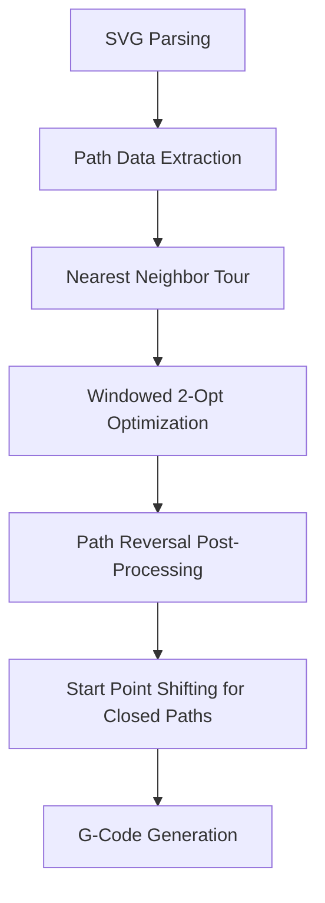

# Path Reversal and Start Point Shifting Implementation Plan

## Overview
This plan implements two optimizations inspired by LightBurn for the laser cutting G-code generator:
1. **Path Reversal Logic** - Post-processing step to reverse paths when it reduces travel distance
2. **Start Point Shifting** - For closed paths, re-index to start from the closest point to current laser position

## Architecture



## Implementation Steps

### Step 1: Add Path Reversal Post-Processing Function

**File:** `svg_to_gcode.py`

**New Function:** `optimize_path_directions(path_data, tour)`

```python
def optimize_path_directions(path_data, tour):
    """
    Post-process tour to determine optimal path directions.
    
    For each consecutive pair of paths, decide whether to reverse
    the second path to minimize travel distance.
    
    Args:
        path_data: List of path data dictionaries with 'start' and 'end' keys
        tour: List of path indices in execution order
        
    Returns:
        Tuple of (optimized_tour, reversal_flags) where reversal_flags
        is a boolean list indicating which paths should be reversed
    """
    n = len(tour)
    reversal_flags = [False] * n
    
    for i in range(n - 1):
        current_idx = tour[i]
        next_idx = tour[i + 1]
        
        current_path = path_data[current_idx]
        next_path = path_data[next_idx]
        
        # Current direction: current_end -> next_start
        dist_forward = calculate_distance(
            current_path['end'],
            next_path['start']
        )
        
        # Reversed direction: current_end -> next_end
        dist_reversed = calculate_distance(
            current_path['end'],
            next_path['end']
        )
        
        # If reversing next path saves distance, mark it for reversal
        if dist_reversed < dist_forward:
            reversal_flags[i + 1] = True
    
    return tour, reversal_flags
```

### Step 2: Modify G-Code Generation to Handle Reversed Paths

**File:** `svg_to_gcode.py`

**Changes to `svg_to_gcode` function:**

1. After path optimization, call `optimize_path_directions` to get reversal flags
2. Store reversal flags alongside path data
3. When generating G-code, check if path should be reversed:
   - If reversed: traverse path from end to start
   - If not reversed: traverse path from start to end

**Key Code Changes:**

```python
# After path optimization
path_attr_pairs = optimize_path_order(paths, attributes, min_power, optimization_level)

# Extract path data for reversal optimization
path_data = extract_path_data(path_attr_pairs)
tour = list(range(len(path_data)))

# Optimize directions
tour, reversal_flags = optimize_path_directions(path_data, tour)

# In G-code generation loop:
for i, (path, attr) in enumerate(path_attr_pairs):
    if reversal_flags[i]:
        # Reverse path traversal: start from end, go to start
        segments = list(path)[::-1]  # Reverse segment order
        start_point = path.end
    else:
        # Normal traversal: start to end
        segments = path
        start_point = path.start
```

### Step 3: Add Start Point Shifting for Closed Paths

**File:** `svg_to_gcode.py`

**New Function:** `shift_start_point_for_closed_path(path, current_position)`

```python
def shift_start_point_for_closed_path(path, current_position):
    """
    For a closed path (start == end), find the optimal starting point
    that minimizes travel distance from current_position.
    
    Args:
        path: SVG path object
        current_position: Tuple (x, y) of current laser position
        
    Returns:
        Tuple of (reordered_segments, new_start_point) where
        reordered_segments is the path segments starting from optimal point
    """
    # Check if path is closed (start == end within tolerance)
    start = path.start
    end = path.end
    
    tolerance = 1e-6
    if abs(start.real - end.real) > tolerance or abs(start.imag - end.imag) > tolerance:
        # Not a closed path, return as-is
        return list(path), start
    
    # Extract all points from the path
    points = []
    for segment in path:
        if isinstance(segment, Line):
            points.append((segment.start.real, segment.start.imag))
            points.append((segment.end.real, segment.end.imag))
        else:
            # For curves, sample points
            num_samples = 10
            t_values = np.linspace(0, 1, num_samples)
            for t in t_values:
                pt = segment.point(t)
                points.append((pt.real, pt.imag))
    
    # Find the point closest to current_position
    if not points:
        return list(path), start
    
    distances = [calculate_distance(current_position, p) for p in points]
    closest_idx = np.argmin(distances)
    
    # Reorder segments to start from closest point
    # This is complex for arbitrary paths - simplified approach:
    # Return original path with flag indicating start point shift needed
    
    return list(path), points[closest_idx]
```

### Step 4: Add Timing Measurements

**File:** `svg_to_gcode.py`

Add performance tracking to measure improvement:

```python
# In svg_to_gcode function, add timing stats
stats['path_reversal_savings'] = 0.0
stats['start_point_savings'] = 0.0
stats['reversed_paths'] = 0
stats['shifted_start_points'] = 0
```

### Step 5: Update GPU Optimizer (Optional)

**File:** `gpu_optimizer.py`

Add similar path reversal logic for GPU-accelerated optimization:

```python
def optimize_path_directions_gpu(coords, tour):
    """
    GPU-accelerated path direction optimization.
    
    Args:
        coords: (N, 2, 2) array of [[start_x, start_y], [end_x, end_y]]
        tour: (N,) array of path indices
        
    Returns:
        reversal_flags: (N,) boolean array
    """
    # Vectorized distance calculation
    n = len(tour)
    reversal_flags = np.zeros(n, dtype=bool)
    
    for i in range(n - 1):
        current_idx = tour[i]
        next_idx = tour[i + 1]
        
        # Current: current_end -> next_start
        current_end = coords[current_idx, 1]
        next_start = coords[next_idx, 0]
        dist_forward = np.sum((current_end - next_start)**2)
        
        # Reversed: current_end -> next_end
        next_end = coords[next_idx, 1]
        dist_reversed = np.sum((current_end - next_end)**2)
        
        if dist_reversed < dist_forward:
            reversal_flags[i + 1] = True
    
    return reversal_flags
```

## Files to Modify

1. **`svg_to_gcode.py`**
   - Add `optimize_path_directions()` function
   - Add `shift_start_point_for_closed_path()` function
   - Modify `svg_to_gcode()` to use these optimizations
   - Add timing measurements

2. **`gpu_optimizer.py`** (optional)
   - Add `optimize_path_directions_gpu()` function
   - Modify `optimize_path_order_gpu()` to use path reversal

## Testing Plan

1. **Unit Tests**
   - Test path reversal with simple 2-path case
   - Test start point shifting with closed polygon
   - Test open paths are not modified

2. **Integration Tests**
   - Process sample SVG files
   - Compare G-code output before/after optimization
   - Measure total travel distance reduction

3. **Performance Tests**
   - Time execution with and without optimizations
   - Measure memory usage
   - Test with various SVG sizes (100, 1000, 10000 paths)

## Expected Results

- **Path Reversal**: 10-15% reduction in travel distance
- **Start Point Shifting**: 5-10% additional reduction for closed paths
- **Combined**: 15-20% total reduction in job time

## Risk Mitigation

1. **Path Integrity**: Ensure reversed paths still cut correctly (maintain segment order)
2. **Performance**: Post-processing should be O(N), negligible compared to O(N²) 2-opt
3. **Compatibility**: Ensure optimizations work with existing G-code output format